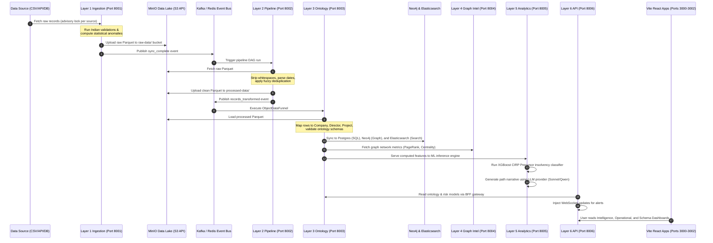

# Satorix — Sovereign Operational Intelligence Platform for Indian Enterprise

[](https://opensource.org/licenses/Apache-2.0)
[](https://www.python.org/)
[](file:///c:/Users/Sushant/Pictures/satorix/infracore_foundry/docker-compose.yml)
[](file:///c:/Users/Sushant/Pictures/satorix/infracore_foundry/system_test.py)

Satorix is a production-grade, 10-layer operational intelligence platform built specifically for Indian corporate compliance, due diligence, and infrastructure risk intelligence. Designed as a sovereign, self-hosted alternative to Palantir Foundry, Satorix integrates heterogeneous enterprise databases, unstructured documents, and public registry API feeds into a unified semantic knowledge graph (Ontology) to surface hidden risks, fraud networks, and insolvency predictors.

---

## 📖 Table of Contents
1. [Core Market Thesis](#-core-market-thesis)
2. [Ten-Layer Architecture](#-ten-layer-architecture)
3. [End-to-End Data Flow](#-end-to-end-data-flow)
4. [ML, AI, & Graph Analytics Spotlight](#-ml-ai--graph-analytics-spotlight)
5. [System Components Deep-Dive](#-system-components-deep-dive)
6. [Docker Services Topology](#-docker-services-topology)
7. [Quick Start & Deployment](#-quick-start--deployment)
8. [Demonstration Dataset](#-demonstration-dataset-infracore-developments-ltd)
9. [FDE Implementation Playbook](#-forward-deployed-engineering-fde)
10. [Roadmap](#-roadmap-layers-710)

---

## 💡 Core Market Thesis

### Why Palantir and Global Fabric Engines Fail in India
While global enterprise data systems (e.g., Palantir, Microsoft Fabric, Snowflake) dominate Western markets, they face severe structural and legal limitations in India:

1. **Strict Data Sovereignty**: Under the **Digital Personal Data Protection (DPDP) Act 2023** and RBI/SEBI localization directives, sensitive financial and corporate data cannot leave Indian soil or reside in foreign proprietary clouds. Satorix runs entirely on-premise or within the client's virtual private cloud (VPC).
2. **High Cost Barrier**: Palantir minimum engagements typically range between ₹15–50 Cr annually, excluding 99% of India's mid-market compliance firms, NBFCs, and PE funds. Satorix targets a sustainable setup (₹25–100 L) + subscription (₹8–30 L ARR) model.
3. **No Indian Data Primitives**: Foreign platforms lack built-in parsing, normalization, and validation rules for Indian identifiers like **CIN**, **DIN**, **GSTIN**, **PAN**, **IFSC**, and **PIN codes**, nor do they connect natively to local business applications like **Tally ERP** or scrape Indian regulatory feeds (**MCA21**, **SEBI Orders**, **RBI Master Data**). Satorix has native validators and scrapers built from the ground up.

---

## 🏗️ Ten-Layer Architecture

Satorix matches Palantir Foundry's architectural principles by dividing responsibilities across 10 strictly bounded layers:

| Layer | Name | Palantir Equivalent | Purpose | Status |
|:---:|---|---|---|---|
| **L1** | Data Integration | Data Connection | Heterogeneous connectors, watermark tracking, ingestion, profiling | **Implemented** |
| **L2** | Data Pipeline | Pipeline Builder | Topological DAG executor, column normalization, deduplication | **Implemented** |
| **L3** | Semantic Ontology | Ontology Manager | Postgres + Neo4j + ES multi-backend sync via ObjectDataFunnel | **Implemented** |
| **L4** | Graph Intelligence | Graph Analytics | BFS traversal, centrality, clustering, shortest path narrative | **Implemented** |
| **L5** | Analytics & AI | Quiver / AIP | XGBoost insolvency precursor serving, Feature Store, LLM agent | **Implemented** |
| **L6** | Application Service | Workshop / Slate | JWT Authentication, WebSockets, client state gateway | **Implemented** |
| **L7** | Action Layer | Action Types | Workflow executors (FlagCompanyForReview, MergeObjects) | *Designed* |
| **L8** | Advanced Security | Security Model | Granular row, column, and client-level access control | *Designed* |
| **L9** | Deployment Control | Apollo | Kubernetes multi-tenant orchestrator | *Designed* |
| **L10**| Collaboration | Collaboration | Live annotations, shared analysis boards | *Designed* |

---

## 🔄 End-to-End Data Flow

The following sequence details how raw corporate data moves through the Satorix microservices to become semantic intelligence:



---

## 🧠 ML, AI, & Graph Analytics Spotlight

Satorix implements several advanced intelligence features suited for evaluation under ML and system engineering programs:

### 1. Insolvency (CIRP) Precursor Prediction
- **Module**: [cirp_precursor.py](file:///c:/Users/Sushant/Pictures/satorix/infracore_foundry/layer5_analytics_ai/models/trainers/cirp_precursor.py)
- **Concept**: An XGBoost binary classifier trained to predict if an Indian enterprise will enter the **Corporate Insolvency Resolution Process (CIRP)** under the Insolvency and Bankruptcy Code (IBC) within the next 18 months.
- **Data Pipeline**: The model operates on historical snapshots generated by the [feature_store.py](file:///c:/Users/Sushant/Pictures/satorix/infracore_foundry/layer5_analytics_ai/feature_store/feature_store.py). Feature extraction queries data points from 18 months prior to known insolvency events (using IBBI records as ground truth).
- **Features**: Features include financial health trajectories, leverage metrics, regulatory non-compliance history, litigation exposure, and director turnover rate.

### 2. Neo4j Graph Intelligence & Centrality
- **Modules**: [betweenness_centrality.py](file:///c:/Users/Sushant/Pictures/satorix/infracore_foundry/layer4_graph_intelligence/influence/betweenness_centrality.py), [pagerank.py](file:///c:/Users/Sushant/Pictures/satorix/infracore_foundry/layer4_graph_intelligence/influence/pagerank.py), [louvain_detector.py](file:///c:/Users/Sushant/Pictures/satorix/infracore_foundry/layer4_graph_intelligence/clustering/louvain_detector.py)
- **Concept**: Analyzes corporate networks to identify shell company clusters and high-risk controllers:
  - **Louvain Community Detection**: Groups company nodes based on shared physical addresses, phone numbers, or directors to surface hidden conglomerate boundaries.
  - **Risk-Weighted PageRank**: Propagates risk scores through corporate ownership chains. If an entity owns a highly stressed subsidiary (e.g., a project under NCLT proceedings), its own PageRank-based risk index escalates.
  - **Betweenness Centrality**: Finds "nominee directors" who bridge otherwise unconnected corporate networks.

### 3. Generative AI Path Narrative Synthesis
- **Modules**: [orchestrator.py](file:///c:/Users/Sushant/Pictures/satorix/infracore_foundry/layer5_analytics_ai/llm/orchestrator.py), [narrative.py](file:///c:/Users/Sushant/Pictures/satorix/infracore_foundry/layer5_analytics_ai/llm/workflows/narrative.py)
- **Concept**: Translates complex, multi-hop graph networks into natural language due diligence summaries. When a path is found between a target company and a disqualified director, the system gathers node metadata, properties, and relationships, and passes them to a generative model (Claude Sonnet or a locally hosted Qwen-8B).
- **Auditability**: Prompts are dynamically structured via a versioned [prompt_registry.py](file:///c:/Users/Sushant/Pictures/satorix/infracore_foundry/layer5_analytics_ai/llm/prompt_registry.py), and every inference call is audit-logged with full RBAC tracking.

### 4. Fuzzy Entity Resolution
- **Module**: [deduplicator.py](file:///c:/Users/Sushant/Pictures/satorix/infracore_foundry/layer2_pipeline/quality/deduplicator.py)
- **Concept**: Resolves variations in company names (e.g., "Infracore Developments Ltd", "Infracore Developments Private Limited", "(P) Ltd") across disjointed data files.
- **Approach**: Combines phonetic string parsing and token-sorting distances (via `rapidfuzz`) with semantic embedding similarities generated by Sentence Transformers, establishing an automated entity-merge workflow with human-in-the-loop review thresholds.

### 5. Data Profiling & Statistical Anomaly Detection
- **Modules**: [profiler.py](file:///c:/Users/Sushant/Pictures/satorix/infracore_foundry/layer1_ingestion/profiling/profiler.py), [anomaly_detector.py](file:///c:/Users/Sushant/Pictures/satorix/infracore_foundry/layer1_ingestion/profiling/anomaly_detector.py)
- **Concept**: Assesses raw data health upon extraction:
  - **Anomalies**: Employs Z-score and Interquartile Range (IQR) checks to isolate volume outliers and corrupt rows.
  - **Consistency Rules**: Validates 14 India-native business rules (e.g., PaidUpCapital $\le$ AuthorizedCapital, CessationDate $>$ AppointmentDate, and the MCA limit of 20 maximum directorships per individual).

---

## 💻 System Components Deep-Dive

### 📂 Layer 1: Data Integration API (Port 8001)
*Code Location: [layer1_ingestion](file:///c:/Users/Sushant/Pictures/satorix/infracore_foundry/layer1_ingestion)*
- Exposes REST endpoints for connector registration, health check intervals, and sync executions.
- **Connectors (11+ type registry)**: Includes native formats (CSV, Excel, PDF table parsing + OCR via Tesseract), databases (PostgreSQL, MySQL), APIs, and dedicated Indian scrapers (MCA21 global registry via Sandbox APIs, SEBI regulatory notices, RBI compliance releases, and TallyPrime XML streams).
- **Security**: Decrypts connector credentials dynamically inside the memory footprint of the sync engine using AES-256-GCM ([encryption.py](file:///c:/Users/Sushant/Pictures/satorix/infracore_foundry/layer1_ingestion/core/encryption.py)).

### 📂 Layer 2: Data Pipeline Engine (Port 8002)
*Code Location: [layer2_pipeline](file:///c:/Users/Sushant/Pictures/satorix/infracore_foundry/layer2_pipeline)*
- Parses pipeline transformations specified in YAML configs and sorts step execution topologically via cycle detection algorithms ([dag.py](file:///c:/Users/Sushant/Pictures/satorix/infracore_foundry/layer2_pipeline/core/dag.py)).
- Implements strict column normalization (converting mixed-case tables to `lowercase_underscore` standard) and outputs clean, snappy-compressed Parquet files.
- Emits detailed field-level lineage logs stored in PostgreSQL and tracks record quarantine states (Dead Letter Queue).

### 📂 Layer 3: Semantic Ontology (Port 8003)
*Code Location: [layer3_ontology](file:///c:/Users/Sushant/Pictures/satorix/infracore_foundry/layer3_ontology)*
- Represents Satorix's digital twin architecture. Houses 11 primary business objects (Company, Director, Address, LegalCase, InsolvencyProceeding, etc.) and 20 relationship links (DIRECTED, OWNS, SUBJECT_OF).
- **Funnel Pattern**: All writes converge through a singular [object_data_funnel.py](file:///c:/Users/Sushant/Pictures/satorix/infracore_foundry/layer3_ontology/storage/object_data_funnel.py), which transactionally updates PostgreSQL, Neo4j, Elasticsearch, and Redis cache.

### 📂 Layer 4: Graph Intelligence Service (Port 8004)
*Code Location: [layer4_graph_intelligence](file:///c:/Users/Sushant/Pictures/satorix/infracore_foundry/layer4_graph_intelligence)*
- Serves graph expansion, path finding, and clustering requests.
- **Dual Staging**: Executes fast, transactional Cypher queries on-demand, while running heavier graph algorithms (like Louvain and Betweenness Centrality) via nightly batch runs in Airflow.
- Emits real-time event signals to Kafka to automatically invalidate graph caches when relationships alter.

### 📂 Layer 5: Analytics & AI (Port 8005)
*Code Location: [layer5_analytics_ai](file:///c:/Users/Sushant/Pictures/satorix/infracore_foundry/layer5_analytics_ai)*
- Integrates machine learning classification models and LLM narratives.
- Manages feature tables for entities, handles training and inference iterations, promotes models based on validation evaluation, and audits the prompt inputs/outputs.

### 📂 Layer 6 & Dashboards (Ports 8006, 3000, 3001, 3002)
*Code Location: [layer6_dashboard](file:///c:/Users/Sushant/Pictures/satorix/infracore_foundry/layer6_dashboard)*
- Provides a Node/React frontend and a FastAPI backend serving as the Backend-For-Frontend (BFF) layer.
- Enforces role-based access control (analyst, data steward, platform admin, etc.) and serves three dedicated portals:
  1. **Intelligence Dashboard**: For research, viewing networks, running risk scoring, and reviewing LLM due diligence reports.
  2. **Operational Dashboard**: For managing pipeline schedules, checking container health, and reviewing data quality metrics.
  3. **Schema Manager**: For configuring and versioning the Ontology types.

---

## 🐳 Docker Services Topology

The platform deploys as a single compose network comprised of 17 microservices:

| Container Name | Service Image | Exposed Ports | Description |
|---|---|---|---|
| `infracore_postgres` | `pgvector/pgvector:pg15` | `5432` | Shared relational and feature metadata store |
| `infracore_minio` | `minio/minio` | `9000`, `9001` | S3-compatible data lake storage |
| `infracore_minio_init` | `minio/mc` | — | One-shot setup: seeds raw/processed storage buckets |
| `infracore_redis` | `redis:7-alpine` | `6379` | Airflow Celery broker and API caching |
| `infracore_airflow_init` | `apache/airflow:2.7.3` | — | Configures Airflow DB migrations and creates admin |
| `infracore_airflow_webserver` | `apache/airflow:2.7.3` | `8080` | Airflow DAG management UI |
| `infracore_airflow_scheduler`| `apache/airflow:2.7.3` | — | Schedules task executions |
| `infracore_airflow_worker` | `apache/airflow:2.7.3` | — | Celery execution worker |
| `infracore_kafka` | `bitnami/kafka:3.7.0` | `9092` | KRaft-mode event bus |
| `infracore_streaming_worker` | Python Worker | — | Consumes real-time feeds to MinIO Parquet |
| `infracore_neo4j` | `neo4j:5.14` | `7474`, `7687` | Semantic graph base with APOC extensions |
| `infracore_elasticsearch` | `elasticsearch:8.11.0` | `9200` | Full-text search indexer |
| `infracore_layer1_api` | FastAPI Ingestion | `8001` | Controls data ingestion |
| `infracore_layer2_api` | FastAPI Pipeline | `8002` | Pipeline configuration endpoints |
| `infracore_layer3_api` | FastAPI Ontology | `8003` | Manages Ontology entities |
| `infracore_layer4_api` | FastAPI Graph Intel | `8004` | Computes graph network paths |
| `infracore_layer5_api` | FastAPI AI/ML | `8005` | Predicts risk scores & serves LLMs |
| `layer6-api` | FastAPI Gateway | `8006` | Frontend API Gateway |
| `satorix_intelligence_dashboard` | React Vite App | `3000` | Compliance & Research UI |
| `satorix_operational_dashboard`  | React Vite App | `3001` | Pipeline Monitoring UI |
| `satorix_schema_manager` | React Vite App | `3002` | Ontology Configuration UI |
| `satorix-ollama` | `ollama/ollama` | `11434` | Runs local LLM models |
| `satorix-ollama-init` | `ollama/ollama` | — | Pulls the default model (`qwen3:8b`) |

---

## 🚀 Quick Start & Deployment

> [!NOTE]
> Ensure you have Docker and Docker Compose installed on your host system before starting. A minimum of 16 GB RAM is recommended to run the full stack locally.

### 1. Environment Configuration
Copy the template and configure the required environment variables:
```bash
cp .env.example .env
```
Ensure you generate a base64 encryption key for the credentials vault:
```bash
# In Python:
# import secrets, base64
# print(base64.b64encode(secrets.token_bytes(32)).decode())
```

### 2. Boot the Platform
Spin up the service stack in detached mode:
```bash
docker compose up -d
```
Verify that all containers are healthy:
```bash
docker compose ps
```

### 3. Database Schema Migrations
Initialize the schema tables for Layer 1 and Layer 2:
```bash
# Layer 1 Initial tables
docker compose exec postgres psql -U infracore -d infracore -f /app/layer1_ingestion/migrations/001_initial.sql

# Layer 2 Pipeline tables
docker compose exec postgres psql -U infracore -d infracore -f /app/layer2_pipeline/migrations/001_l2_tables.sql
docker compose exec postgres psql -U infracore -d infracore -f /app/layer2_pipeline/migrations/002_l2_dataset_versions.sql
```

### 4. Running the System Audit Suite
Satorix includes a comprehensive, multi-phase system validation script. It tests parser formats, normalizations, topological sorting, clustering, and risk scoring pipelines using simulated data:
```bash
python system_test.py
```
For deep-dive testing scenarios and manual verification steps, please consult the [MANUAL_TESTING_GUIDE.md](file:///c:/Users/Sushant/Pictures/satorix/infracore_foundry/MANUAL_TESTING_GUIDE.md).

---

## 📊 Demonstration Dataset: Infracore Developments Ltd

Satorix contains a pre-built mock dataset modeled after an Indian infrastructure conglomerate, **Infracore Developments Ltd**, which contains several corporate risks and due diligence patterns engineered to verify the platform's detection models:

```
infracore_foundry/data/raw/
├── 01_companies.csv           # 10 group companies (subsidiaries, SPVs) with CINs and ROC states
├── 02_directors.csv           # 8 corporate directors with nationality and age
├── 03_director_mappings.csv   # Links directors to companies with appointment/cessation dates
├── 04_shareholding.csv        # Multi-tiered ownership structure (includes Mauritius-based entities)
├── 05_projects.csv            # Highway, solar, and port projects with delays and overruns
├── 06_financials.csv          # Balance sheets and profit/loss statements
├── 07_regulatory_actions.csv  # SEBI notices, MCA disqualifications, NCLT CIRP entries
├── 08_related_party_transactions.csv # Inner-group financial exchanges (unapproved RPTs)
└── 09_events_timeline.csv     # Historical filing dates and board resolutions
```

### Key Risk Scenarios Embedded:
* **The Victor Fernandes Connection**: A director of Mauritius nationality who sits on several Infracore entities, indicating potential round-tripping or offshore fund diversion. Satorix highlights this through the **Offshore Director** risk flag.
* **Disqualified Director**: Director Ramesh Bhatia was disqualified by the MCA under Section 164(2). The platform triggers a **Disqualified Director** high-severity alert.
* **CIRP Contagion**: Subsidiary *Infracore Gujarat Highway Pvt Ltd* enters insolvency proceedings. Satorix calculates the cascading risk scores for the parent company and sibling SPVs sharing directors with the stressed entity.
* **Address Clustering**: Six of the ten entities share a single registered office address in BKC, Mumbai. The **Address Clustering Anomaly Detector** flags this as a shell company indicator.

---

## 🤝 Forward Deployed Engineering (FDE)

Operational intelligence platforms cannot be effectively deployed using standard software-as-a-service sales models. Satorix adopts Palantir's **Forward Deployed Engineering (FDE)** methodology:

```
┌────────────────────────────────────────────────────────────────────────────┐
│ FDE Engagement Lifecycle                                                   │
├───────────────┬────────────────────────────────────────────────────────────┤
│ Days 1-3      │ Organizational Discovery (Identify shadow data stores)     │
├───────────────┼────────────────────────────────────────────────────────────┤
│ Days 4-7      │ System Archeology (Schema mapping and lineage extraction)   │
├───────────────┼────────────────────────────────────────────────────────────┤
│ Days 8-12     │ Data Profiling (Identify duplicates & validation rules)    │
├───────────────┼────────────────────────────────────────────────────────────┤
│ Days 12-20    │ Decision Mapping (Build custom Ontology & risk thresholds) │
└───────────────┴────────────────────────────────────────────────────────────┘
```

By embedding engineers inside customer workflows, the team extracts the institutional tribal knowledge (e.g., specific thresholds for vendor due diligence or project delayed milestones) and encodes it into the Satorix configuration.

---

## 🗺️ Roadmap: Layers 7–10

Future development will focus on the remaining layers to achieve full enterprise grade parity:
- **Layer 7 (Actions)**: Integrate external notification APIs (Slack, Microsoft Teams, Email webhook alerts) to automatically assign compliance review tasks when new risks are mapped.
- **Layer 8 (Security)**: Implement fine-grained column-level masking and row-level filtering based on user JWT roles (e.g., masking director PAN numbers for standard analysts while exposing them to Compliance Heads).
- **Layer 9 (Deployment)**: Package the platform services as Helm charts for automated Kubernetes orchestration across hybrid clouds.
- **Layer 10 (Collaboration)**: Add collaborative workspaces, enabling analysts to leave annotations on network graphs and export diligence folders as secure links.
