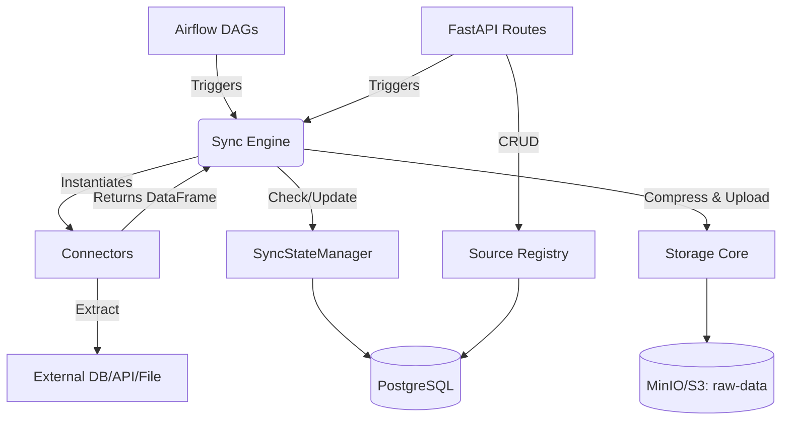

# Technical Audit & Functional Analysis: Infracore Foundry - Layer 1

## 1. System Overview
**Core Purpose:** 
The project is a data ingestion and integration engine named **"Infracore Foundry — Layer 1 Data Integration API"**. It provides automated, schedulable data extraction from various sources (SQL, SaaS applications, files, object storage), converts incoming data into optimized Parquet format, and securely stores it in S3-compatible object storage (MinIO) for downstream usage.

**Problem Solved & Target Users:** 
It addresses the challenge of building robust, scalable "EL" (Extract and Load) pipelines. It abstracts the complexity of connecting to heterogeneous data sources, handling incremental state (CDC, bookmarks), and safely landing raw data into a data lake architecture. The target users are data engineers, infrastructure teams, and downstream analytics applications.

**Application Type:** 
This is a composite system relying on a **FastAPI REST API**, an **Apache Airflow Orchestration Layer**, and **Background Workers (Celery + Redis)**. It fits the paradigm of a microservice-based data integration platform.

---

## 2. Architecture & Design
**Overall Architecture:**
The project follows a **Layered Data Ingestion Architecture** built with containerized microservices. It bridges synchronous API control patterns with asynchronous pipeline orchestration.

**High-Level Component Interaction:**
1. **Control Plane (FastAPI):** Exposes REST endpoints to manage data source configurations, trigger manual syncs, and monitor connection health.
2. **Metadata Store (PostgreSQL):** Persists data source registry, credentials (encrypted), synchronization states, and audit logs.
3. **Orchestrator (Airflow):** Periodically wakes up via DAGs to fetch active data sources and trigger the sync engine or health checker for each.
4. **Execution Engine (Python/Pandas):** The core Python logic that connects to data sources, extracts data into memory (Pandas DataFrames), and pushes it to object storage.
5. **Data Lake Storage (MinIO):** Lands the raw extracted data as compressed Parquet files partitioned by date and client.

**Design Patterns Used:**
- **Factory/Registry Pattern:** `SourceRegistry` manages dynamic instantiation of connectors based on `source_type`.
- **Strategy Pattern:** Specific data extraction logic is implemented in different connector classes (e.g., `CSVConnector`, `MySQLConnector`, `RESTAPIConnector`) extending a common `BaseConnector`.
- **State Pattern (Cursor-based Pagination):** `SyncStateManager` remembers the last extracted timestamps/IDs for incremental logic.

---

## 3. Folder & File Responsibility Mapping (CRITICAL)

### `infracore_foundry/` (Root)
The primary wrapper containing environment and deployment definitions.
- **`docker-compose.yml`**: Defines the entire local topology (Postgres, MinIO, Redis, Airflow, API).
- **`requirements.txt`**: System dependencies.

### `layer1_ingestion/` (Core Application Layer)
The Python module holding all business logic.

#### `api/` (Control Plane)
Handles user-facing REST requests.
- **`app.py`**: **[ENTRY POINT]** The FastAPI application definition, lifespan events, CORS, and router registration.
- **`routes/sources.py`**: CRUD operations for managing `DataSource` records.
- **`routes/sync.py`**: API endpoints to manually trigger a sync or fetch sync history.
- **`routes/health.py`**: Endpoints for checking connection health.
- **`routes/webhooks.py`**: Endpoints for receiving push-based webhook data.

#### `core/` (Foundational Utilities)
- **`database.py`**: Manages SQLAlchemy engine, connection pooling, and FastAPI `Depends` DB contexts.
- **`storage.py`**: MinIO client wrapper. Converts Pandas `DataFrame` to `pyarrow.Table`, adds metadata, and lands data as `snappy`-compressed `.parquet` files.
- **`config.py`**: Pydantic BaseSettings loading `.env` variables.
- **`encryption.py`**: Logic for encrypting sensitive connection credentials in Postgres.

#### `connectors/` (Extraction Strategies)
The integrations layer.
- **`base_connector.py`**: The abstract base class defining `extract_full()`, `extract_incremental()`, and `compute_checksum()`.
- **`csv_connector.py`, `mysql_connector.py`, `rest_api_connector.py`, etc.**: Concrete implementations of connection logic mapping native data formats to Pandas DataFrames.

#### `registry/` (Metadata & Storage Models)
- **`models.py`**: SQLAlchemy definitions (`DataSource`, `SyncState`, `SyncRun`, `DataSourceHealth`).
- **`source_registry.py`**: Business logic wrapper around models for creating, soft-deleting, and masking sensitive source data.

#### `sync/` (Orchestration Engine)
- **`sync_engine.py`**: **[CORE LOGIC]** The brain of the data flow. Resolves incremental config, triggers the connector, receives a DataFrame, calculates run duration, uploads via `storage.py`, and updates `SyncState`.
- **`state_manager.py`**: Reads/Writes the high-watermark (cursor/bookmark) for incremental syncs into the database to prevent duplicate extractions.

#### `airflow/` (Scheduling)
- **`dags/extraction_dag.py`**: **[ENTRY POINT]** The Airflow DAG that runs on a schedule (e.g., `0 */6 * * *`), queries the DB for active sources, and programmatically spawns extraction tasks for the `SyncEngine`. Contains the `layer1_data_extraction` and `layer1_health_checks` DAGs.

#### `health/` (Monitoring)
- **`monitor.py`**: Pings active data connections to ensure they are alive and schema validates.
- **`alert_manager.py`**: Generates and persists `Alert` objects if a sync fails or data anomaly is detected.

#### `schema/` (Data Profiling & Normalization)
- **`detector.py`, `type_inferrer.py`**: Inspects columns of incoming DataFrames for semantic types.
- **`indian_identifiers.py`**: Detects India-specific PII/Identifiers.

---

## 4. Execution Flow (End to End)

**Example Flow: Scheduled Incremental Sync via Airflow**

1. **Trigger (Airflow):** The `layer1_data_extraction` DAG fires in Airflow based on a cron schedule (`extraction_dag.py`).
2. **Context Setup:** Airflow task invokes the core Python code inside `infracore_foundry/layer1_ingestion`.
3. **Lookup (Registry):** The task asks `SourceRegistry` to fetch the target `DataSource` from PostgreSQL.
4. **Instantiate (Connector):** Base config identifies the source (e.g., `mysql`). The task dynamically instantiates `MySQLConnector` with decrypted vault variables (`sync_engine.py`).
5. **State Retrieval:** `SyncStateManager` queries Postgres for the `last_extracted_timestamp` for this specific source.
6. **Extraction:** `MySQLConnector.extract_incremental(config)` fires, returning a Pandas `DataFrame` containing only rows modified since the last timestamp.
7. **Storage:** `storage.py::upload_parquet` receives the DataFrame, converts it to PyArrow, appends Infracore metadata, and pushes to MinIO (`raw-data/client_id/source_id/.../batch.parquet`).
8. **State Update:** `SyncEngine` updates `SyncState` with the highest timestamp seen in the DataFrame and marks the `SyncRun` as completed.
9. **Alerting:** `AlertManager` evaluates the run. If successful, nothing happens. If failed, it logs it and potentially triggers a notification.

---

## 5. Data Flow & Business Logic
- **Incoming Vectors:** Data is pulled via Airflow schedules or Pushed via `/webhooks`.
- **Transformation (Minimal):** As an "EL" tool, Layer 1 performs very little transformation. Data is loaded into a Pandas DataFrame, basic types are inferred (`schema/`), and structural metadata is appended to the PyArrow Table schema.
- **Persistence Route:** Memory (FastAPI/Worker) -> PyArrow Table -> MinIO Object Storage (Parquet file, partitioned by `/YYYY/MM/DD/`).
- **Telemetry Flow:** Sync stats (rows affected, time elapsed, checksums) bypass MinIO and flow back into PostgreSQL `sync_states` and `sync_runs` tables.

---

## 6. Key Functionalities
1. **Dynamic Source Registry:** `SourceRegistry` dynamically maps a string identifier (e.g. `rest_api`) to a python class (`RESTAPIConnector`).
2. **Full vs Incremental Syncing:** Connectors implement cursor-based iteration. The `SyncEngine` automatically injects the latest watermark.
3. **Parquet Conversion:** Automatic optimization of raw text/API/SQL data into columnar Parquet format natively using PyArrow `snappy` compression.
4. **Connection Monitoring:** Airflow invokes `ConnectionHealthMonitor` to constantly ensure endpoints haven't drifted or gone offline.
5. **Data Locality Management:** Generating distinct file paths `client_id/source_id/YYYY/MM/DD/batch_id.parquet` to enforce deep multitenancy in storage.

---

## 7. Tech Stack & Dependencies
- **FastAPI / Uvicorn:** Base REST framework, highly asynchronous, auto-generates OpenAPI docs.
- **Apache Airflow:** Used solely as the distributed master scheduler for sync tasks.
- **Pandas & PyArrow:** The primary data abstraction and serialization engines.
- **SQLAlchemy (PostgreSQL dialect):** ORM matching Python objects to persistent connection registry.
- **MinIO (S3 Client):** Object storage mimicking AWS S3, used via the `minio` pip library.
- **Celery / Redis:** Task queue mechanics bundled via Airflow workers.

---

## 8. DevOps & Runtime
- **Docker Compose Topology:** The entire environment spins up via `docker-compose.yml`.
- **Infrastructure Containers:** `infracore_postgres` (metadata), `infracore_minio` (data lake), `infracore_redis` (message broker).
- **Application Containers:** `infracore_layer1_api` (FastAPI instance on port 8001), `infracore_airflow_*` (Webserver, Scheduler, Worker).
- **Initialization Scripts:** `minio-init` runs bash commands using the `mc` CLI to pre-seed the `raw-data`, `processed-data`, and `profiling-reports` buckets automatically on startup.

---

## 9. Strengths & Weaknesses

**Strengths:**
- **Excellent Separation of Concerns:** Core utilities, Web API routes, Connectors, and Airflow logic are strictly demarcated.
- **Extensible Connector Architecture:** The `BaseConnector` pattern makes it incredibly easy for a new developer to add a `MongoDBConnector` without touching the SyncEngine.
- **Standardized Output:** Pushing everything to Parquet enforces a rigid, highly-performant data lake standard from day one.
- **Self-Healing State:** Tracking sync boundaries in PostgreSQL guarantees at-least-once delivery recovery during crash events.

**Weaknesses / Code Smells:**
- **Memory Bound Extractions:** The `SyncEngine` loads data into a strictly single-node Pandas DataFrame (`df = connector.extract_full(config)`). If a SQL table has 500 million rows, the Airflow worker will crash with an Out-of-Memory (OOM) error. It lacks chunked or streaming extraction directly to MinIO.
- **Coupling of Airflow & FastAPI Layers:** Airflow DAGs directly import from `layer1_ingestion`. This forces the Airflow containers and API containers to share an identical filesystem/image, reducing decoupling.

---

## 10. Security & Scalability

**Security:**
- **Credential Vaulting:** `encryption.py` is utilized to encrypt sensitive API keys and database passwords before they touch PostgreSQL.
- **Soft Deletes:** `SourceRegistry` uses `soft_delete_source()`, ensuring audit trails are never completely wiped.
- *Vulnerability:* The `/sync/{source_id}/trigger` API does not appear to enforce granular client-based RBAC in the snippet shown, relying simply on UUID guessing.

**Scalability:**
- *Pros:* Airflow + Celery Executor allows horizontal scaling of workers to run thousands of concurrent connector extractions.
- *Cons:* Because Pandas materializes data in RAM, massive datasets will bottleneck individual Celery nodes.

---

## 11. Improvement Recommendations

1. **Implement Generator/Streaming Extraction:** 
   Refactor `BaseConnector.extract_*` to yield chunks (e.g., `Iterator[pd.DataFrame]`) and update `storage.py` to use `pyarrow.parquet.ParquetWriter` to append to the file on the fly. This avoids Pandas OOM constraints.
2. **Decouple Airflow from Codebase:**
   Instead of Airflow importing `layer1_ingestion`, the Airflow DAG should purely use the `SimpleHttpOperator` to send a POST request to `/api/v1/sync/{source_id}/trigger`. This fully isolates the API microservice.
3. **Partitioning Strategy Refinement:**
   The `YYYY/MM/DD` MinIO partitions are based on ingestion time. Provide a configuration option to partition Parquet files based on a logical date column inside the dataset itself (e_g., `created_at` timestamp).

---

### Advanced Diagram: Module Dependency Graph

